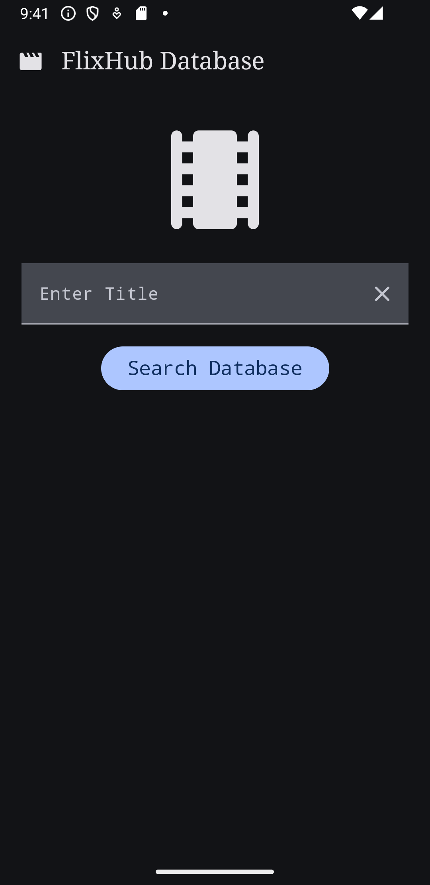
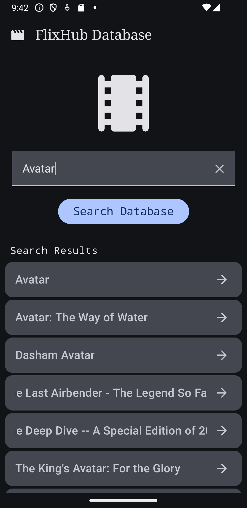
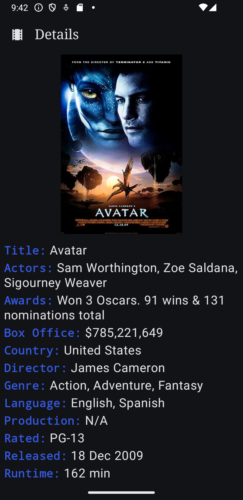
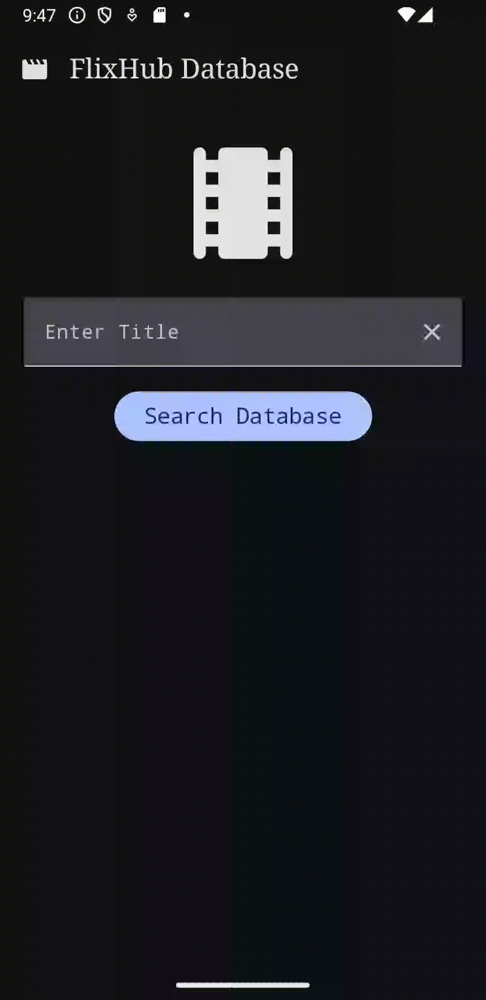

<h1 align="center">FlixHub</h1>

<p align="center">
  <a href="https://opensource.org/licenses/Apache-2.0"></a>
  <a href="https://android-arsenal.com/api?level=21"></a>
  <br>
  <a href="https://wa.me/+5511986726064"></a>
  <a href="https://www.linkedin.com/in/jhonybguerra/"></a>
  <a href="mailto:jhonybguerra@gmail.com"></a>
</p>

<p align="center">  

⭐ Esse é um projeto para demonstrar meu conhecimento técnico no desenvolvimento Android nativo com Kotlin. Mais informações técnicas abaixo.

🎬 O FlixHub é um aplicativo de faz buscas sobre detalhes de filmes no banco de dados OMDB, utilizando as bibliotecas e tecnologias mais recentes do Android.

</p>

</br>

<p float="left" align="center">



</p>

## Download
<a href='https://play.google.com/store/apps/details?id=com.jbgcomposer.newshub'></a>

Ou faça o download da <a href="apk/app-debug.apk?raw=true">APK diretamente</a>. Você pode ver <a href="https://www.google.com/search?q=como+instalar+um+apk+no+android">aqui</a> como instalar uma APK no seu aparelho android.

## Tecnologias usadas e bibliotecas de código aberto

- Minimum SDK level: 28
- [Linguagem Kotlin](https://kotlinlang.org/)
- Arquitetura: MVVM integrada com os componentes do Lifecycle do Android Jetpack.
- Clean Code: Princípios de Clean Code aplicados em todo o projeto para garantir código legível, manutenível e testável. Isso inclui a separação clara de responsabilidades, uso de nomes significativos para variáveis e funções, e aderência aos princípios SOLID.
- Compose: Interface do usuário construída utilizando Jetpack Compose, a nova ferramenta declarativa do Android para construir layouts de forma mais intuitiva e eficiente.
- Navigation Component: Implementação do componente de Navegação do Jetpack para uma experiência de usuário fluida e uma gestão eficiente dos fragmentos na navegação entre as diferentes telas do aplicativo.
- Retrofit: Consumo eficiente da API de filmes usando Retrofit para chamadas de rede.
- ViewModel: Uso intensivo do ViewModel para gerenciamento de dados relacionados à UI, garantindo a persistência de dados durante mudanças de configuração e separando as preocupações da lógica de negócios e da interface de usuário.
- Kotlin Flow: Uso de StateFlow para atualizações de dados reativas e observáveis na interface do usuário.
- Dagger-Hilt: Injeção de dependência com Hilt para desacoplar a criação de objetos e melhorar a testabilidade.
- Coroutines: Operações assíncronas com Coroutines para chamadas de rede e interações com o banco de dados.
- Coil: Biblioteca para carregamento e caching eficiente de imagens.
- Moshi: Conversão de JSON para objetos Kotlin utilizando a biblioteca Moshi.

## Features

### Tela de início apresentando um campo de buscas solicitando ao usuário o nome de um filme.


### Ao selecionar o filme, a tela de detalhes é aberta.


# Licença

```xml
Copyright [2024] [Jhony Bossolane Guerra]

   Licensed under the Apache License, Version 2.0 (the "License");
   you may not use this file except in compliance with the License.
   You may obtain a copy of the License at

     http://www.apache.org/licenses/LICENSE-2.0

   Unless required by applicable law or agreed to in writing, software
   distributed under the License is distributed on an "AS IS" BASIS,
   WITHOUT WARRANTIES OR CONDITIONS OF ANY KIND, either express or implied.
   See the License for the specific language governing permissions and
   limitations under the License.

```
